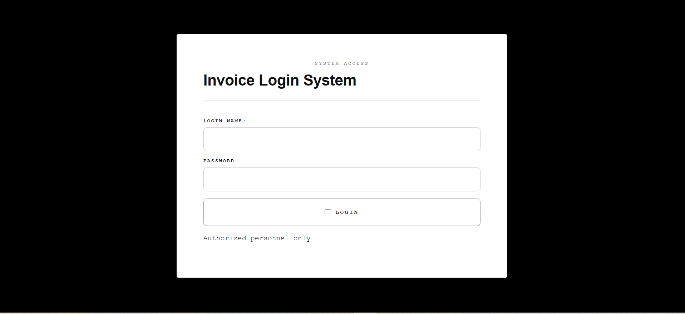
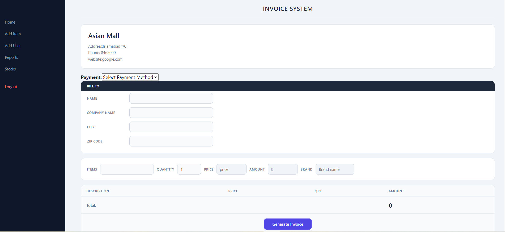
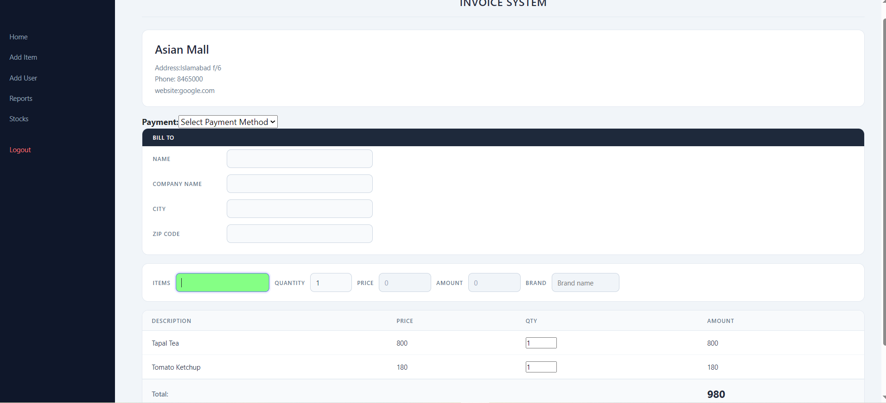
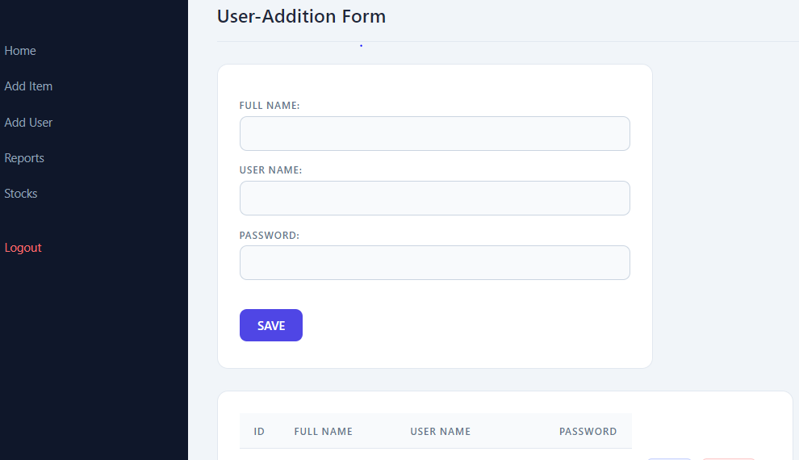
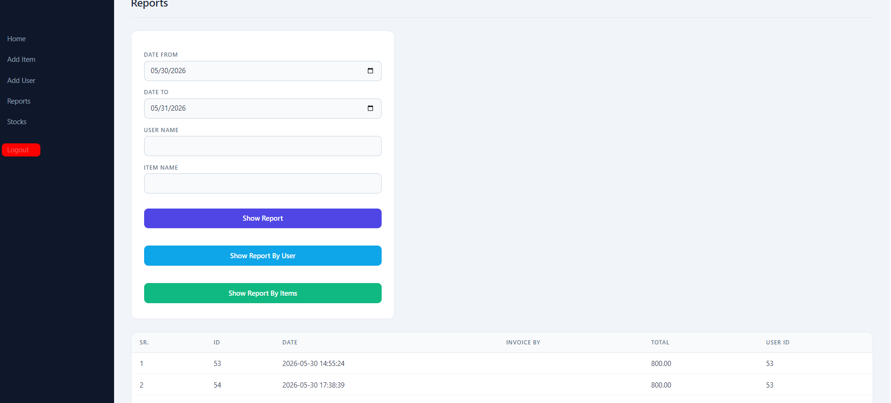
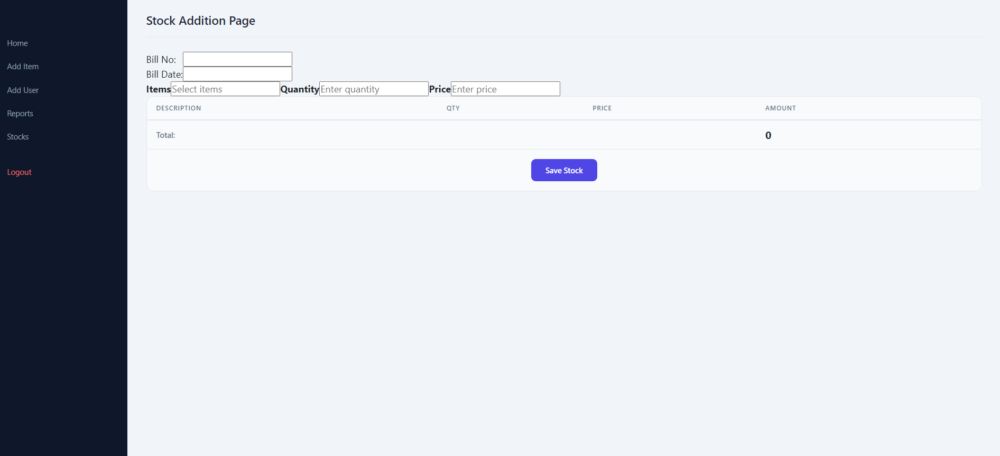
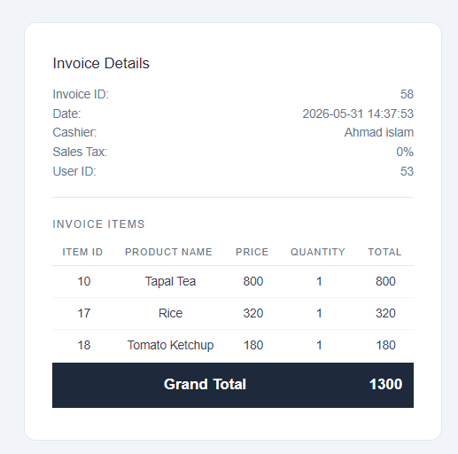

# 🧾 Invoice Management System

A full-stack web-based **Invoice & POS Management System** built with **PHP** and **MySQL**. 
Designed for small businesses to manage inventory, generate invoices, track stock, 
and produce sales reports — all from a clean, modern interface.

---

## 💪 Built From Scratch

This project was built **entirely by hand** without any frameworks, intellisense, 
AI assistance, or copy-paste. Every single line of code was written manually including:

- 🗄️ **SQL Queries** — all `SELECT`, `INSERT`, `UPDATE`, `DELETE` queries written manually
  with full understanding of table structure, WHERE conditions, and JOINs
- ⚙️ **PHP Functions** — all backend logic and service files written from scratch
- 🔄 **AJAX Services** — `item-services.php` and `invoice-services.php` built manually
  using pure Fetch API without any shortcuts
- 🎨 **CSS Styling** — every selector, property, and value handwritten
  with no CSS frameworks or utilities
- 📝 **JavaScript Logic** — all DOM manipulation, table filling, and
  real-time updates written in pure vanilla JavaScript
- 🔒 **Security** — parameterized queries written manually to prevent SQL injection

> This demonstrates a deep understanding of core web technologies.
> No frameworks were used — just pure PHP, MySQL, JavaScript, HTML and CSS.
> Every comma, semicolon, and bracket placed with full understanding of the language syntax.

---
## 🖥️ Screenshots

### 🔐 Login Page


### 🧾 Invoice System — Main Page


### 🧾 Invoice System — With Items


### 📦 Item Management


### 👤 User Management


### 📊 Reports


### 🗃️ Stock Addition


### 🖨️ Generated Invoice Receipt


---

## ✨ Features

- 🔐 **Secure Login System** — session-based authentication
- 🧾 **Invoice Generation** — create and print professional invoices
- 📦 **Item Management** — add, edit, delete inventory items with AJAX
- 👤 **User Management** — manage cashiers and staff accounts
- 📊 **Sales Reports** — filter by date, user, or item name
- 🗃️ **Stock Management** — track and update stock levels
- 🖨️ **Print Invoice** — clean printable POS receipt layout
- 🎨 **Modern UI** — dark sidebar, card-based layout, responsive design
- ⚡ **AJAX Powered** — no page reloads for data operations

---

## 🛠️ Technologies Used

| Technology | Purpose |
|------------|---------|
| PHP | Backend logic & server-side processing |
| MySQL | Database management |
| HTML / CSS | Frontend structure and styling |
| JavaScript | Dynamic interactions |
| AJAX (Fetch API) | Real-time data without page reload |
| Bootstrap | UI components |
| jQuery & jQuery UI | Autocomplete and DOM manipulation |
> 💡 This project is built entirely with vanilla PHP, JavaScript, 
> HTML and CSS — no frameworks used. All logic written from scratch.

---

## 🚀 How to Run Locally

1. Install **WAMP** or **XAMPP**
2. Clone this repository:
```bash
   git clone https://github.com/Ahmad917-spec/Invoice-system.git
```
3. Copy the project folder to `C:\wamp64\www\`
4. Import the database:
   - Open **phpMyAdmin**
   - Create a new database
   - Import the `.sql` file from the project
5. Update `config.php` with your database credentials:
```php
   $conn = new mysqli("localhost", "root", "", "your_database_name");
```
6. Open browser and go to:
```
   http://localhost/Invoice-system
```
7. Login with your credentials

---

## 📁 Project Structure

```
Invoice-system/
├── index.php              # Main invoice page
├── item-form.php          # Item management
├── user-form.php          # User management
├── reports.php            # Reports page
├── stock-form.php         # Stock management
├── sidebar.php            # Shared sidebar component
├── config.php             # Database connection
├── invoice.php            # Invoice view/print page
├── item-services.php      # Item AJAX services
├── invoice-services.php   # Invoice AJAX services
├── sidebar.css            # Sidebar styles
├── invoice.css            # Invoice page styles
├── reports.css            # Reports page styles
├── libs/                  # Bootstrap, jQuery libraries
└── screenshots/           # Project screenshots
```

---

## 🔒 Security

- ✅ Parameterized queries to prevent SQL injection
- ✅ Session-based authentication
- ✅ Password protected routes
- ✅ Input validation

---

## 👨‍💻 Author

**Ahmad** — [@Ahmad917-spec](https://github.com/Ahmad917-spec)

---

## 📄 License

This project is open source and available under the [MIT License](LICENSE).